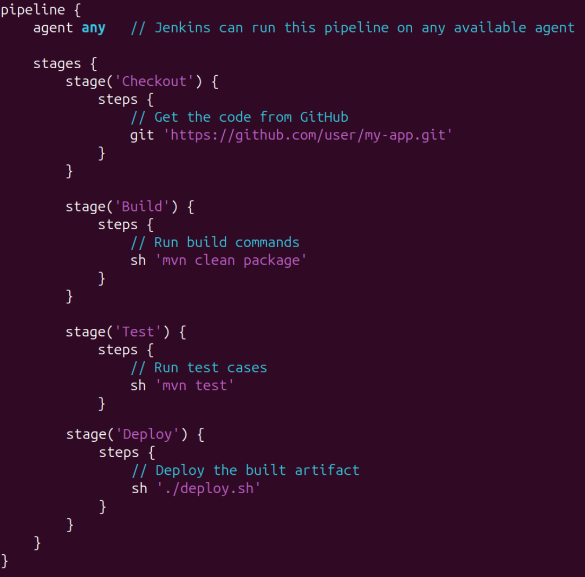

# CI/CD Servers

CI/CD مخفف Continuous Integration و Continuous Deployment یا Continuous Delivery است. این مفهوم به مجموعه‌ای از روش‌ها و ابزارها گفته می‌شود که هدف آن‌ها خودکارسازی فرآیند ساخت (Build)، تست (Test) و استقرار (Deployment) نرم‌افزار است. در این میان، CI/CD Server یا «سرور CI/CD» نقشی کلیدی دارد؛ زیرا مسئول اجرای این مراحل به صورت خودکار و هماهنگ است. این سرورها به‌طور معمول کد جدیدی که توسعه‌دهندگان در مخازن کد (مانند GitHub یا GitLab) قرار می‌دهند را دریافت کرده، تست‌ها را اجرا می‌کنند و در صورت موفقیت، نسخه‌ی جدید نرم‌افزار را برای استقرار آماده می‌سازند.

سرورهای CI/CD وظیفه دارند کل چرخه‌ی تحویل نرم‌افزار را خودکار کنند. در بخش Continuous Integration، سرور پس از هر commit، به‌صورت خودکار کد را build می‌کند و تست‌های واحد (unit tests) و سایر تست‌های خودکار را اجرا می‌نماید تا اطمینان حاصل شود که تغییرات جدید باعث بروز خطا نشده‌اند. در مرحله‌ی Continuous Delivery یا Deployment، همین سرور می‌تواند نسخه‌ی نهایی را در محیط staging یا production مستقر کند. این کار سبب می‌شود فرآیند توسعه سریع‌تر، دقیق‌تر و بدون نیاز به دخالت دستی انجام گیرد.

یک سرور CI/CD معمولاً از چند بخش تشکیل شده است: مخزن کد (Repository) که کد منبع یا همان کد اصلی محصول در آن ذخیره می‌شود، pipeline که مجموعه‌ای از مراحل (Stages) مانند build، test و deploy را شامل می‌شود، و agent یا runner که وظیفه‌ی اجرای واقعی این مراحل را دارد. زمانی که توسعه‌دهنده کدی را در مخزن push می‌کند، سرور CI/CD با استفاده از مکانیزم های مانند Webhook یا Trigger متوجه تغییر می‌شود و pipeline تعریف‌شده را آغاز می‌کند. این pipeline‌ها می‌توانند به‌صورت فایل YAML یا JSON در پروژه تعریف شوند.

استفاده از سرورهای CI/CD باعث افزایش کیفیت و سرعت توسعه نرم‌افزار می‌شود. خودکار بودن فرآیند تست و استقرار باعث کاهش خطاهای انسانی و اطمینان از ثبات کد در تمام مراحل می‌شود. همچنین، تیم‌های توسعه می‌توانند بازخورد فوری از تغییرات دریافت کنند، که این امر رفع باگ‌ها و مشکلات را آسان‌تر می‌سازد. از دید DevOps، این سرورها ابزار اصلی برای دستیابی به چرخه‌های انتشار سریع‌تر (Fast Release Cycles) و پیاده‌سازی فرهنگ automation-first هستند.

 در دنیای DevOps ابزارهای گوناگونی برای پیاده‌سازی CI/CD وجود دارد. از معروف‌ترین آن‌ها می‌توان به Jenkins (یکی از محبوب‌ترین و متن‌بازترین ابزارها)، GitLab CI/CD (که مستقیماً با GitLab یکپارچه است)، GitHub Actions، CircleCI، Travis CI و TeamCity اشاره کرد. هر کدام از این ابزارها ویژگی‌ها و قابلیت‌های خاص خود را دارند، اما همه در اصل یک هدف مشترک دارند: خودکارسازی، یکپارچه‌سازی مداوم، و تحویل سریع و مطمئن نرم‌افزار.

## Jenkins

یک ابزار Open Source برای پیاده‌سازی فرآیندهای Continuous Integration (CI) و Continuous Delivery (CD) است.
هدف آن خودکارسازی مراحل build، test، deploy و در کل چرخه‌ی توسعه نرم‌افزار است. Jenkins به‌صورت یک سرور مرکزی اجرا می‌شود که می‌تواند pipelineها را برای پروژه‌های مختلف مدیریت کند. هر pipeline مجموعه‌ای از مراحل است که به‌ترتیب اجرا می‌شوند، مثلاً:

* گرفتن کد از GitHub, اجرای تست‌ها, build کردن نرم‌افزار, استقرار در محیط staging یا production

### مفاهیم کلی در jenkins


* Job (یا Project)
    * واحد اصلی کار در Jenkins است. هر job می‌تواند یک پروژه‌ی build، تست یا deploy باشد.
* Build
    * فرآیند اجرای Job. هر بار که Jenkins یک Job را اجرا می‌کند، آن را به عنوان یک build ذخیره می‌کند (مثلاً Build #1, #2, ...).
* Agent
    * این ابزار میتواند روی چند سرور اجرا شود. Node یا Agent همان ماشین‌هایی هستند که jobها روی آن‌ها اجرا می‌شوند.
* Master
    * بخش مرکزی Jenkins که pipeline را مدیریت می‌کند و وظایف را بین agentها تقسیم می‌کند.

### Jenkinsfile

فایل Jenkinsfile همان قلب Jenkins است. این فایل معمولاً در ریشه‌ی پروژه قرار دارد.این فایل یک فایل متنی (معمولاً UTF-8) است که در ریشه‌ی هر مخزن قرار می‌گیرد و کل تعریف Pipeline را با یک فایل مبتنی بر Groovy نگه می‌دارد؛ به‌عبارت دیگر «دستورالعملِ خودکارسازیِ» مراحلی مثل checkout، build، test و deploy در همین فایل نوشته می‌شود و چون داخل کد منبع ذخیره می‌شود، تاریخچه‌ی تغییرات pipeline نیز میتوان نگهداری شود. در محیط‌هایی مثل Multibranch Pipeline هر برنچ می‌تواند Jenkinsfile مستقل خودش را داشته باشد و Jenkins با مشاهده‌ی تغییرات (با webhook یا polling) آن را اجرا می‌کند. نکته‌ی مهم این است که Jenkinsfile باعث می‌شود pipeline نسخه‌بندی شود و تیم‌ها بتوانند منطق CI/CD را همان‌جا (همراه با کد) توسعه و بررسی کنند؛ همچنین استفاده از Credentials، متغیرهای محیطی، triggers و post-actions در همین فایل تنظیم می‌شود تا اجرای امن و تکرارپذیر فراهم گردد.

#### روش های نوشتن Jenkinsfile

دو روش و رویکرد نوشتن Jenkinsfile وجود دارد که هر کدام مزایا و موارد کاربرد خاص خود را دارند: Declarative Pipeline ساختارمند و خواناتر است، سینتکس آن ساده‌تر است، قابل‌اعتبارسنجی (linter) و مناسب تیم‌ها و جریان‌های استاندارد CI/CD است و کمتر احتمال خطاهای پیچیده‌ی برنامه‌نویسی را دارد. در مقابل Scripted Pipeline یک اسکریپت Groovy کامل است (شامل حلقه‌ها، شرط‌ها و try/catch) که کنترل و انعطاف‌پذیری بیشتری برای منطق‌های پیچیده، جریان‌های شرطی خیلی داینامیک یا تعامل با APIهای سفارشی می‌دهد—اما نگهداری و امن‌سازی آن سخت‌تر است. به‌طور خلاصه، اگر نیاز به خوانایی، استانداردسازی و سرعت پیاده‌سازی داشته باشیم از Declarative استفاده میکنیم؛ اگر منطق خیلی پیچیده یا داینامیک لازم باشد و توسعه‌دهنده‌ای با تجربه Groovy در تیم حضور داشته باشد، Scripted گزینه‌ی مناسب‌تری است.

#### دستورات مهم در jenkins pipeline
* نمونه‌ی از Declarative Pipeline


/// caption
///


> Pipeline: تعریف کلی فرایند

> Stages: تعریف بخش‌هایی مانند Build، Test، Deploy\

> Steps: دستورات اجرایی (مثل اجرای shell command یا فراخوانی ابزارها)

##### clone یا checkout کردن repository

```
git ‘url’
```

#### اجرای دستور shell در محیط لینوکس
```
sh 'command'
```

* اجرای دستور در محیط Windows
```
bat 'command'
```

#### چاپ متن در خروجی کنسول

```
echo 'text'
```

#### گرفتن تایید دستی از کاربر
```
input message: 'Approve deployment?'
```

#### ذخیره خروجی build
* ذخیره خروجی build برای مراحل بعدی یا دانلود
```
archiveArtifacts 'target/*.jar'
```

#### متغیر محیطی
* تعریف متغیرهای محیطی در pipeline
```
environment { KEY = "VALUE" }
```

#### post
* تعیین اقداماتی بعد از موفق یا ناموفق بودن job

```
post { success { ... } failure { ... } }
```

#### اجرای چند stage به صورت همزمان
```
parallel { ... }
```

#### triggers

* triggers: مشخص میکند چه زمانی pipeline اجرا شود. برای مثال کد زیر تعیین میکند که pipeline هر روز کاری ساعت 2 اجرا شود.

```
triggers {
  cron('H 2 * * 1-5')
}
```

#### تعیین یک agent برای اجرا
```
agent { label 'linux-node' }
```


