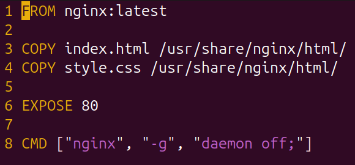

# containerization: Docker

## Docker

داکر (Docker) یک پلتفرم Open Source است که برای ساخت، اجرا و مدیریت برنامه‌ها در قالب کانتینر (Container) استفاده می‌شود. ایده‌ی اصلی Docker این است که به‌جای اجرای برنامه‌ها به‌صورت مستقیم روی سیستم‌عامل میزبان، آن‌ها را در یک محیط ایزوله‌شده به نام کانتینر اجرا کنیم. این کانتینرها شامل کد برنامه، کتابخانه‌ها، وابستگی‌ها و تنظیمات موردنیاز هستند، بنابراین برنامه در هر محیطی (لینوکس، ویندوز، کلود یا حتی لپ‌تاپ شخصی) دقیقاً همان‌طور اجرا می‌شود که انتظار داریم.

> با یک سرچ ساده میتوان راه های نصب docker را روی سیستم‌عامل های مختلف پیدا کرد، بنابراین در این بخش مستقیم به کار کردن با داکر میپردازیم.

هنگامی که داکر در سیستم نصب میشود به عنوان یک برنامه client-server در سیستم اجرا میشود که این برنامه به بخش های زیر تقسیم میشود:


* یک بخش به نام dockerd که به عنوان سرور اجرا می شود و به صورت مداوم درحال اجرا شدن است. قلب تپنده داکر این بخش است چون ساخت و مدیریت کانتینر ها را این بخش برعهده دارد.
* یک رابط خط فرمان (CLI) به نام docker که کاربر با آن تعامل دارد و دستورات ساخت و مدیریت کانتینر ها را به آن میدهد. Docker cli توسط یک API با dockerd ارتباط دارد و همه‌ی دستورات وارد شده توسط کاربر را از طریق این API به ‌dockerd منتقل میکند.
* APIs که مشخص می‌کنند docker cli چگونه می‌توانند با Dockerd ارتباط برقرار کرده و به آن دستور بدهد.

## Docker image

داکر ایمیج یکی از اساسی‌ترین بخش‌های کلیت سیستم Docker است که کدهای اجرا شدنی را در خود نگه‌داری می‌کند. اگر قبلا با ماشین‌های مجازی یا Virtual Machine کارکرده باشید می‌توانید جایگزین داکر ایمیج را در VM همان اسنپ‌شات (Snapshot) در نظر بگیرید.

همانطور که می‌دانید ما از داکر برای ایجاد، اجرا و استقرار اپلیکیشن‌ها در کانتینر استفاده می‌کنیم. داکر ایمیج در این پروسه برای اینکه در فرایند اجرا اپلیکیشن به ما کمک کند یکسری کد، کتابخانه، ابزارها، ملزومات و… را در خود نگهداری می‌کند.

پس هدف نهایی هر داکر ایمیجی این است که اپلیکیشن مورد نظرمان را در داکر اجرا کند. زمانی که یک کاربر داکر ایمیجی را اجرا کند این داکر ایمیج می‌تواند به یک یا چندین نمونه از کانتینر تبدیل شود. 

داکر ایمیج‌ها از چندین لایه مختلف تشکیل می‌شوند که نقطه تشکیل هر لایه مربوط به لایه قبل از خود خواهد بود. یعنی هر لایه تکمیل کننده لایه ی قبلی خود است. این ساختار لایه‌ای باعث می‌شود که سرعت انجام فرایند Build کردن افزایش پیدا کند، قابلیت استفاده‌پذیری مجدد از امکانات بیشتر شود و در نهایت فضای کمتری از حافظه ذخیره‌سازی اشغال شود.

لایه‌ها به صورت فایل‌های Read-Only ذخیره می‌شوند. همچنین زمانی که شما یک داکر ایمیج را ایجاد کنید دیگر امکان تغییر آن وجود ندارد. در این حالت اگر بخواهید یکسری تغییرات را اعمال کنید، ابتدا باید یک کانتینر دیگر را همراه با تغییرات مد نظرتان ایجاد کرده و سپس آن را به عنوان یک ایمیج دیگر ذخیره کنید.

به عنوان یک نکته مهم این را بدانید که ایمیج‌ها براساس هسته سیستم عامل میزبانی اجرا می‌شوند. یعنی هر ایمیج شامل یک نسخه از هسته ی سیستم عامل است و برنامه های مورد نیاز روی آن هسته نصب میشوند و در نهایت خروجی به عنوان یک ایمیج حاصل میشود.

برای مثال برای ایجاد ایمیج یک وب سرور ابتدا باید یک ایمیج که شامل هسته اصلی سیستم عامل (برای مثال Ubuntu Linux) را اجرا کنید و سپس پکیج‌هایی مانند Apache یا PHP را به آن اضافه کنید.

## Base image

در داکر وقتی می‌خواهیم یک ایمیج بسازیم، معمولا از یک نقطه‌ی شروع استفاده می‌کنیم که به آن Base Image (ایمیج پایه) گفته می‌شود. یک Base Image ایمیجی است که به‌عنوان لایه‌ی پایه برای ساخت ایمیج‌های جدید مورد استفاده قرار می‌گیرد و معمولا شامل سیستم‌عامل یا محیط اجرایی اولیه است (مثلاً Ubuntu، Debian، Alpine) که برنامه‌نویس یا تیم DevOps می‌تواند روی این بیس ایمیج، پکیج‌ها و کدهای مورد نیاز خود را اضافه کند و یک ایمیج نهایی بسازند.

## Docker file

Dockerfile یک فایل متنی ساده است که به‌عنوان یک دستورالعمل عمل می‌کند تا یک image داکر را از ابتدا تا انتها بسازد. این فایل شامل یک سری دستورات داکر است که به این سرویس می‌گوید چگونه یک image را باید ساخت. با استفاده از Dockerfile، ما می‌توانیم به‌طور خودکار imageهای را تولید کنیم که شامل برنامه‌ها، کتابخانه‌ها و تنظیمات مورد نیاز ما باشند. به این ترتیب نیازی به ساخت دستی image نیست و فرایند ساخت خودکار و یکپارچه می‌شود. برای مثال میتوانیم تعیین کنیم که چه فایل های درون image ساخته شده باشد و چه برنامه های و چگونه اجرا شوند.

در تصویر زیر یک مثال از داکر فایل میبینید که یک سرویس nginx را اجرا میکند و فایل های لازم را روی آن کپی میکند:


/// caption
///

در خط اول: دستور FROM مشخص میکند که base image کدام باشد که در اینجا از base image سرویس nginx استفاده کرده است، یعنی ایمیج پایه خود دارای سرویس nginx است. دستور FROM در ابتدای اکثر Docker file ها قرار میگیرد و ایمیج پایه را مشخص میکند.

خط سوم و چهارم: با استفاده از دستور COPY فایل های مورد نیاز را از سیستم میزبان (سیستمی که داکر روی آن درحال اجرا است) به درون ایمیج ساخته شده (همان طور که گفته شد این Dockerfile قرار است به یک ایمیج تبدیل شود) کپی میکند. بدین معنی که وقتی این داکر فایل به یک ایمیج تبدیل شد و از این ایمیج ساخته شده یک کانتینر ساخته شد، این کانتینر دارای فایل های کپی شده است.

خط پنجم: دستور EXPOSE پورت 80 را باز میگذارد. هر کانتینر که اجرا میشود، در ابتدا یک محیط کاملا ایزوله است و از بیرون به آن هیچ ارتباطی وجود ندارد. با دستور EXPOSE میتوان تعیین کرد که کانتینر چه پورتی را باز کند و بتوان از طریق آن پورت را آن دسترسی داشت. در این مثال پورت 80 باز شده است که میتوان از طریق آن به سرویس HTTP دسترسی داشت.

خط هشتم: در خط های قبلی فایل ها را کپی کردیم، پورت مورد نیاز را هم باز کردیم. حالا نوبت به اجرای برنامه است. دستور CMD تعیین میکند وقتی کانتینر ساخته شد و بالا آمد چه دستوری روی آن اجرا شود. که در این مثال سرویس nginx را اجرا میکند.

## Docker volume

هنگامی که یک کانتینر بالا می‌آید فایل سیستم آن فقط مربوط به خود کانتینر است و دسترسی به فایل سیستم بیرونی که همان ماشین میزبان است ندارد و این فایل سیستم ناپایدار است و در صورت حذف شدن کانتینر همه‌ی اطلاعات آن حذف میشود.

Volume در داکِر یک مکان نگهداری‌ داده است که خارج از فایل‌سیستم لایه‌ایِ ایمیج و کانتینر قرار دارد و توسط داکِر مدیریت می‌شود. هدف اصلی volumes این است که داده‌ی پایدار (persistent) و قابل اشتراک‌گذاری بین کانتینرها باشد — یعنی وقتی کانتینر حذف شد، داده‌ها می‌توانند باقی بمانند و مورد استفاده قرار گیرند.

## Docker network

در داکر، «شبکه» مشخص می‌کند که کانتینرها چگونه به هم یا به میزبان و اینترنت وصل شوند. هر کانتینر یک یا چند اینترفیس شبکه دارد و می‌تواند در یک یا چند شبکه قرار بگیرد. داکر چند درایور شبکه (network drivers) پیش‌فرض دارد که هر کدام مناسب یک سناریو هستند:


* bridge
    * شبکه‌ای داخلی روی یک میزبان ایجاد می‌کنه؛ کانتینرها داخل همدیگر را می‌بینند (با اسم) و ترافیک بین‌شان NAT می‌شود.

* host
    * کانتینر از شبکه‌ی میزبان استفاده می‌کند — یعنی مانند یک پروسه مستقیم روی ماشین اجرا می‌شود و آدرس/پورت‌ها را مشترک دارد.
    * وقتی نیاز به کمترین سربار شبکه و یا  وقتی که لازم است کانتینر به interfaceهای میزبان دسترسی مستقیم داشته باشد از این نوع درایور استفاده میکنیم.

* none
    * هنگامی که کانتینر لازم نیست هیچ اتصال شبکه‌ای داشته باشد فقط به loopback داخلی نیاز داریم از این نوع استفاده میکنیم.

## دستورات پرکاربرد Dockerfile


* FROM
* اولین دستور در بیشتر Dockerfile‌هاست.
مشخص می‌کند ایمیج پایه (Base Image) برای ساخت ایمیج جدید چه باشد.
```
FROM ubuntu:22.04
```


* RUN
یک دستور یا مجموعه‌ای از دستورات را در هنگام ساخت ایمیج اجرا می‌کند.
معمولاً برای نصب پکیج‌ها یا تغییر تنظیمات سیستم استفاده می‌شود.
```
RUN apt-get update && apt-get install -y curl
```


* COPY
فایل‌ها یا پوشه‌ها را از سیستم لوکال (محیط ساخت) به داخل ایمیج کپی می‌کند.
```
COPY index.html /usr/share/nginx/html/
```


* ADD
شبیه COPY است ولی امکانات بیشتری دارد:
می‌تواند فایل‌های آرشیو (مثلاً .tar.gz) را به‌صورت خودکار Extract کند.
می‌تواند فایل‌ها را مستقیماً از یک URL دانلود کند.
```
ADD https://example.com/file.tar.gz /tmp/
```


* WORKDIR
مسیر کاری پیش‌فرض داخل کانتینر را مشخص می‌کند.
همه‌ی دستورات بعد از آن (مثل RUN, COPY, CMD) در همین دایرکتوری اجرا می‌شوند.
```
WORKDIR /app
```


مشاهده نسخه داکر:
```
docker version
```


اطلاعات وضعیت داکر (سیستم، storage drivers، تعداد کانتینرها و غیره):
```
docker info
```

* Docker hub

Docker hub یک رجیستری (مخزن) رسمی و ابری برای نگهداری، اشتراک‌گذاری و کشیدن (pull) ایمیج‌های داکر است، همان جایی که اکثر ایمیج‌های رسمی مثل nginx یا ubuntu را پیدا و دانلود می‌کنیم.

* گرفتن یک ایمیج از Docker Hub
```
docker pull nginx:latest
```
برای مشخص کردن ایمیج باید نام آن همراه با ورژن آن ذکر شود که در این مثال nginx نام ایمیج و latest ورژن آن یعنی آخرین نسخه منتشر شده آن.

* نمایش لیست ایمیج‌های محلی

```
docker images
# OR
docker image ls
```

* حذف یک ایمیج (مثلاً به‌خاطر فضای دیسک)
```
docker rmi nginx:latest
```
برای ساخت و اجرای یک کانتینر از روی یک ایمیج که قبلا یا از docker hub گرفته شده است یا از روی یک dockerfile ساخته شده است از دستور run استفاده میکنیم:

* اجرای کانتینر (برای مثال nginx در پس‌زمینه با نگاشت پورت)
```
docker run -d --name mynginx -p 8080:80 nginx:latest
```
با name– نام کانتینر را مشخص میکنیم و با p- یک پورت را به پورتی که کانتینر نیاز دارد اختصاص میدهیم که در این مثال پورت 80 در کانتینر باز است و ما پورت 8080 را از سیستم میزبان به آن اختصاص میدهیم یعنی هر درخواستی برای پورت 8080 آمد آن را به پورت ‌80 کانتینر بفرست و برعکس. در دستور run همیشه پارامتر آخر مربوط به نام ایمیجی است که میخواهیم با آن کانتینر را بسازیم.

* فهرست کانتینرهای درحال اجرا
```
docker ps
```
* و برای نمایش همه ی کانتینر ها و حتی کانتینر های که متوقف شده اند

```
docker ps -a
```
* گرفتن لاگ کانتینر
هر کانتینر که اجرا میشود خروجی دارد و برای نمایش خروجی یک کانتینر از دستور log استفاده میکنیم.

```
docker logs mynginx
```
پارامتر آخر اسم کانتینری است که میخواهیم log های آن را نمایش دهیم.

اگر بخواهیم به صورت زنده خروجی کانتینر را ببینیم، یعنی در لحظه هرآنچه کانتینر log میکند را ببینیم از f- استفاده میکنیم.


* ورود به شِل یک کانتینر (تعامل با کانتینر)
همان طور که در بخش های پیشین گفته شد هر کانتینر دارای یک هسته ی سیستم عامل لینوکس است و میتوان به عنوان یک سیستم عامل با آن تعامل کرد. برای اتصال به shell یک کانتینر و وارد کردن دستورات به صورت مستقیم از دستور exec استفاده میکنیم. این پارامتر در داکر یک دستور را مستقیم درون یک کانتینر اجرا میکند و جواب دستور را برمیگرداند. میتوان با it- دستور وارد شده را به صورت تعاملی اجرا کرد یعنی بعد از اجرا دستور از محیط شل خارج نمیشود بلکه میتوان با آن تعامل داشت.

```
docker exec -it mynginx /bin/bash
```
در این مثال shell کانتینر که bash نام دارد را اجرا میکند.


* متوقف کردن و حذف کانتینر
```
docker stop mynginx
docker rm mynginx
```
میتوان در دستور run با rm– مشخص کرد که با توقف کانتینر، حذف کانتینر نیز به صورت خودکار صورت گیرد.	

* کپی فایل از میزبان به کانتینر
```
docker cp ./localfile.txt mynginx:/usr/share/nginx/html/
```

* کپی فایل از کانتینر به میزبان
```
docker cp mynginx:/var/log/nginx/access.log ./access.log
```
