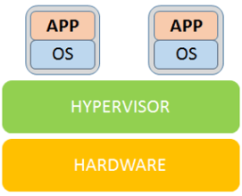
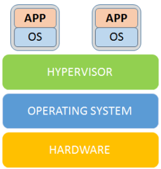
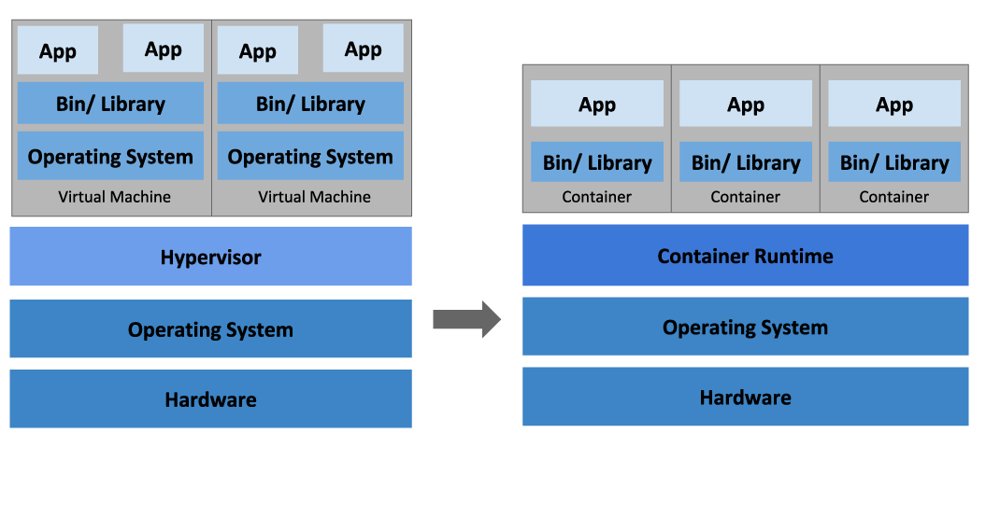
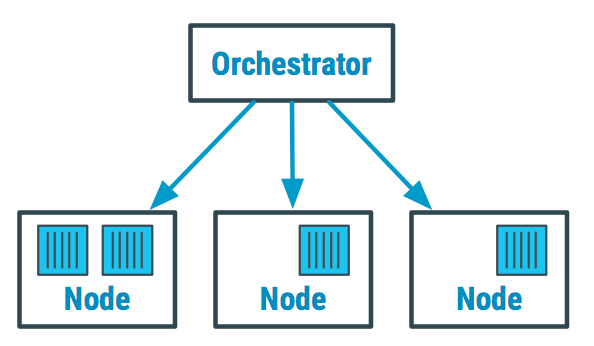
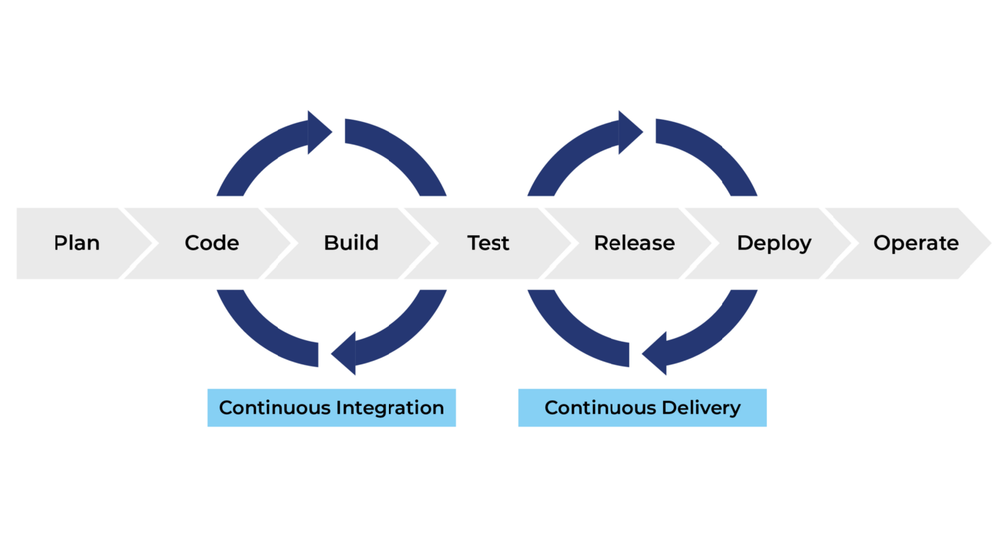
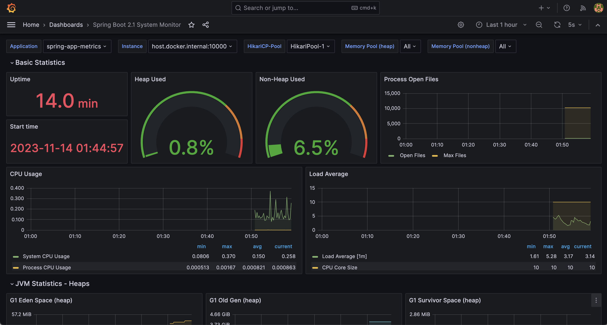

# اصول DevOps

## virtualization

در اوایل عصر اینترنت و نرم‌افزار،‌ برنامه ها مانند کشتی های عظیمی بودند که باید روی دریایی از سخت‌افزار مستقر میشدند. توسعه دهنده‌ها کد را روی کامپیوتر شخصیشان توسعه میداند و سپس آن را به تیم operation تحویل میدادند،‌ تیم operation نیز یک سرور فیزیکی تهیه میکرد و به صورت دستی نصب بسته‌ها،‌ کتابخانه‌ها و انجام تنظیمات را انجام می‌داد،‌ اگر همه چیز درست پیش میرفت برنامه روی آن سرور اجرا می‌شد. اما این کار یک عمل تکرار پذیر نبود چون فقط لازم بود تا یک نسخه از یک کتابخانه روی سرور با نسخه‌ی روی کامپیوتر شخصی برنامه نویس(همان محیط توسعه) فرق داشته باشد تا برنامه رفتاری کاملا متفاوت روی سرور نشان دهد. از این پدیده به عنوان "Works on my machine" یاد میشود.

برای کم کردن تاثیر این مشکل سازمان ها فایل های به نام "Golden images" ساختند. مدیر سیستم یک سرور را از صفر راه‌اندازی میکرد،‌ کتابخانه های و بسته ها را نصب می‌کرد سپس از آن سیستم عامل یک disk image میساخت و سپس این image را روی سرور های دیگر نصب میکرد. سازمان ها به این image بخصوص golden image میگفتند.

اما این کار هم روش بهینه‌ی نبود زیرا برای یک تغییر کوچک باید به صورت دستی روی تمام سرورها عملیات نصب را انجام داد. البته در همین حین هم مردم به سمت اسکریپت های نصب برای خودکار کردن عملیات نصب سیستم رفتند اما این روش هم چنان بهینه نبود.

در همان زمان، ایدهٔ مجازی‌سازی به میدان آمد و داستان رنگ تازه‌ای گرفت. به‌جای نگه داشتن یک سرور فیزیکی برای هر برنامه (که هزینه و مصرف انرژی بالایی داشت) محققان و شرکت‌ها راهی برای اجرای چند «ماشین مجازی» روی یک سخت‌افزار واحد یافتند. ماشینِ مجازی شباهت زیادی به یک کامپیوتر واقعی داشت یعنی سیستم‌عامل خودش را داشت، می‌توانست reboot شود و نرم‌افزارها را مستقل از محیط بیرونی ایزوله اجرا کند. در قلب این فناوری، «هایپروایزر» قرار داشت — یک لایهٔ نرم‌افزاری که منابع سخت‌افزار را بین چند ماشین مجازی تقسیم می‌کرد. یعنی منابع یک سیستم می توانست بر روی چند سیستم‌عامل تقسیم شود و هر سیستم‌عامل با توجه به نیازی که دارند منابع بگیرند.

لایه‌ی که بین ماشین مجازی (guest machine) ماشین میزبان (host machine) قرار می‌گیرد hypervisor نام دارد. این لایه مدیریت منابع بین ماشین های مجازی نصب شده را برعهده دارد و میتواند بر اساس تنظیماتی که برای هر ماشین مجازی انجام شده منابع را در اختیار ماشین مجازی قرار دهد. کار اصلی این لایه ترجمه کردن درخواست ها بین منابع مجازی و منابع سخت‌افزاری است.

### دو نوع اصلی hypervisor
هایپروایزر نوع اول یا bare-metal که مستقیماً روی سخت‌افزار اجرا می‌شود. این نوع بین سخت افزار و ماشین های مجازی قرار میگیرد یعنی مستقیم با سخت‌افزار ارتباط دارد و درخواست‌ها را مستقیم به سخت‌افزار میرساند. این یعنی سیستم عامل یا برنامه ها دیگر وابسته به سخت‌افزار نی‌ستند و می‌توانند با کمک hypervisor مستقل از سخت‌افزار عمل کنند یا میتوان چند سیستم عامل را روی یک سخت‌افزار واحد اجرا کرد چون دیگر سیستم عامل وابسته به سخت افزار نیست.

/// caption
///

و یکی از مزیت های دیگر این نوع، کم کردن محدودیت‌هاست یعنی سیستم عامل میتواند روی سخت‌افزار های متعددی بدون توجه به سازگاری با سخت‌افزار اجرا شود چون رابط اصلی آن دیگر hypervisor است.

همانطور که گفته شد Bare-Metal hypervisor این امکان را فراهم می‌کند که سیستم‌عامل‌ها و برنامه‌های مرتبط با آن‌ها روی انواع مختلف سخت‌افزار اجرا شوند. همچنین می‌توان چندین سیستم‌عامل و ماشین مجازی (guest machines) بر روی یک سرور فیزیکی (host machine) مستقر شوند. از آنجا که ماشین‌های مجازی مستقل از سخت‌افزار فیزیکی هستند، می‌توانند از یک دستگاه به دستگاه دیگر یا از یک پلتفرم به پلتفرم دیگر منتقل شوند و workloads و شبکه، حافظه، ذخیره‌سازی و قدرت پردازشی را بر اساس نیاز میان چندین سرور توزیع کرد.

هایپروایزر نوع دوم یا hosted-hypervisors، این نوع مستقیم روی سخت‌افزار نصب نمی‌شود بلکه به عنوان یک نرم‌افزار روی یک OS نصب میشود و از طریق این OS میانی با سخت‌افزار ارتباط دارد.

سیستم های مهمان نیز روی این hypervisor که روی یک سیستم‌عامل دیگر نصب شده نصب میشوند.

/// caption
///

مجازی‌سازی در سطح دیتاسنتر و سرور نقطه‌عطفی بود که نحوهٔ استفادهٔ سازمان‌ها از سخت‌افزار و ارائهٔ سرویس‌ها را به‌کلی تغییر داد. مجازی‌سازی دارای مزایای بزرگی بود. به طوری که یک دیتاسنتر که قبلاً با ده‌ها سرورِ فیزیکی پر شده بود، حالا با همان سخت‌افزار می‌توانست ده‌ها یا صدها ماشین مجازی را میزبانی کند. تیم‌های توسعه و عملیات می‌توانستند با استفاده از قالب‌های VM یا snapshots، محیط‌های آزمایشی را سریع‌تر بسازند و در صورت خطا به وضعیت قبلی بازگردند. امکاناتی مثل live migration (انتقالِ یک VM در حال کار از یک میزبان به میزبان دیگر) و snapshot‌ گرفتن، انعطاف‌پذیری و در دسترس‌پذیری را بالا بردند.

اما مجازی‌سازی هم معایبی داشت. هر VM یک سیستم‌عامل کامل داشت یعنی منابعِ بیشتری مصرف می‌شد: حافظه، فضای دیسک، و زمانِ بوت. برای تیم‌هایی که نیاز به چرخهٔ توسعهٔ سریع و دفعات بسیار بالای استقرار داشتند (CI/CD)، بوتِ چند دقیقه‌ایِ VM ها و سنگینی آنها بِه‌سرعت تبدیل به مانع شد. همچنین VM image ها (فایل های که VM ها از روی آن نصب می‌شوند) حجیم و مدیریت به‌روز نگه‌داشتن‌شان پیچیده بود.

برای حل بخشی از این مشکلات، ابزارها و روش‌هایی رشد کردند: مدیریت پیکربندی (configuration management) مثل CFEngine، بعد Puppet و Chef و سپس Ansible آمدند تا پس از نصب شدن VM ها، تنظیمات را به‌صورت قابل‌تکرار اعمال کنند. به‌جای نصب دستی بسته‌ها، یک playbook یا manifest تعریف می‌شد که سرور را به وضعیت موردنظر می‌رساند. این باعث شد که حتی VM های تازه‌ نصب شده بتوانند به‌صورت خودکار پیکربندی شوند؛ اما چرخهٔ کلی هنوز سنگین و تا حدی کند بود چون هنوز زمان بوت شدن VM ها طولانی بود.

در پایانِ این بخشِ، باید گفت که مجازی‌سازی پلی بود میان دنیای فیزیکی و دنیای کانتینری که بعداً آمد. مجازی‌سازی مشکلاتِ بزرگی را حل کرد، هزینه‌ها و پیچیدگیٔ فیزیکی را کاهش داد و امکان چابکی بیشتری فراهم آورد. اما وزنِ سیستم‌عاملِ کامل و زمان‌های راه‌اندازی آن، جرقهٔ جستجو برای راه‌حل‌های سبک‌تر را روشن کرد. این جستجو در ادامه راه به ظهور فناوری‌هایی انجامید که کانتینرها را ممکن کردند.

## Containerization and Orchestration

همان طور که در بخش قبلی گفته شد سازمان ها ابتدا برنامه ها را روی سرور های فیزیکی اجرا می‌کردند و هر سرور حکم یک ماشین مجزا را داشت، سیستم‌عامل، کتابخانه‌ها، تنظیمات همه به صورت دستی و با اسکریپت‌های متعددی نصب می‌شدند.

با ورودِ مجازی‌سازی (virtualization) داستان جهشی پیدا کرد. به‌جای اختصاص یک سرور فیزیکی به هر OS هایپروایزرها امکان اجرای چند ماشین مجازی (VM) روی همان سخت‌افزار را دادند؛ هر VM همانند یک کامپیوتر کامل رفتار می‌کرد و ایزولاسیونِ قوی‌تری فراهم می‌نمود.

اما VMها هر‌کدام وزنِ خودشان را داشتند، هر کدام یک سیستم‌عامل کامل، پس زمانِ بوت، مصرفِ حافظه و حجمِ VM image ها هنوز مانعِ اجرای چرخه‌های سریع توسعه و مقیاس‌پذیری نرم‌افزار می‌شد.

در همین حین بود که مهندسین روی ایده‌ای کار کردند که بعداً به control groups یا «cgroups» معروف شد مکانیزمی در هستهٔ لینوکس برای محدودسازی و مدیریت منابع (CPU، حافظه، I/O و…) مجموعه‌ای از پردازش‌ها. cgroups تعیین می‌کند هر گروه از پروسس‌ها چقدر از منابع را می‌توانند مصرف کنند و امکان مانیتورینگ منابع را فراهم می‌آورد. Cgroups این امکان را میدهد تا مجموعه‌ای از پروسس‌ها را گروه‌بندی کرد و برای آن گروه محدودیت یا سهمِ منابع تعریف کرد، برای مثال مقدار حافظهٔ مجاز، سهم CPU و غیره.

cgroups، همراه با مفهومی دیگر به‌نام namespaces پا به عرصه گذاشت. Namespaces یا فضای اسمی که سازوکار هسته لینوکس است، که «دید» یک پروسس را از منابع سیستم ایزوله می‌کند  مثلاً دیدن PIDها، شبکه، دستگاه های mount شده و کاربران و غیره. هر namespace یک نوع مجزا دارد و وقتی یک پروسس داخل namespace خاصی قرار می‌گیرد، فقط نُمایی از منابع را می‌بیند که مربوط به همان namespace است. یعنی میتوان یک برای یک فرایند تعیین کرد که چه مقدار از منابع را در اختیار بگیرد و با چه فرایندهای دیگری ارتباط داشته باشد.

وقتی نیازمندی های پایه در هسته پیاده شدند، پروژه‌هایی مثل (LXC (Linux Containers پدید آمدند تا این قابلیت‌ها را به‌صورت عملی دربیاورند: LXC در حوالی 2008 به‌عنوان روشی برای اجرای چند «سیستمِ لینوکسی ایزوله» روی یک میزبان معرفی شد و نشان داد که می‌شود بدون سربارِ یک kernel جدا، محیط‌های ایزوله و سبک ساخت.

/// caption
///

با وجود قابلیت‌های فنی، چیزی کم بود: تجربهٔ توسعه‌دهنده، ابزارِ ساخت registry  ، image مرکزی و یک جریان کاری ساده. این‌جا بود که Docker (که در ۲۰۱۳ رونمایی و اوپن‌سورس شد) نقشی کلیدی بازی کرد. Docker با معرفی Dockerfile برای توصیف ساخت image CLI ساده، و Docker Hub به‌عنوان registry عمومی، مفهومِ «یک‌بار بساز، هرجا اجرا کن» را به دنیای توسعه‌دهندگان آورد. Docker با استفاده از ویژگی های توسعه داده شده در کرنل لینوکس مفهوم کانتینر را به وجود آورد.

 یعنی کانتینرها دیگر فقط یک تکنیکِ هسته‌ای در لینوکس نبودند؛ بلکه به یک ابزار روزمرهٔ توسعه و عرضه تبدیل شدند.

> Image: فایلی که از روی آن container ساخته میشود

> Registry: جایی که میتوان فایل های image را از آن دریافت کرد یا روی آن آپلود کرد

همراه با پراکندگی کانتینرها در محیط‌های واقعی، نیاز به مدیریتِ تعداد زیادی کانتینر و سرویس هم بالا رفت. یعنی دیگر کنترل دستی کانتینر ها در سازمان ها بهینه نبود. گوگل که سال‌ها قبل تجربه‌هایی مشابه در مقیاسِ بزرگ (Borg و Omega) داشت، الهام‌بخش پروژه‌هایی شد که نهایتاً به Kubernetes انجامید؛ Kubernetes در 2013 به‌عنوان یک پروژهٔ اوپن‌سورس معرفی شد و ابزارهای لازم برای اورکستریشنِ کانتینرها (پادها، دیپلویمنت‌ها، سرویس‌یابی، scheduler و غیره) را دمِ دستِ همه گذاشت. این ترکیب «کانتینرِ سبک + ارکستریشن مقیاس‌پذیر» راهِ معماری‌های cloud-native و microservices را گشود.

/// caption
///

Orchestration به‌معنای «مدیریت خودکار چرخهٔ اجرا برنامه‌ها و سرویس‌ها در مقیاس بزرگ» است یعنی وقتی تعداد زیادی کانتینر، سرویس، شبکه و ذخیره‌سازی دارید، ارکستراتوار وظیفه دارد آنها را بر اساس قواعد مشخص شده راه‌اندازی، هماهنگ، مقیاس، نگهداری و در صورت نیاز ترمیم کند. همانند رهبر یک ارکستر که از روی نت‌ها به سازها می‌گوید چه زمانی و چگونه اجرا کنند، ارکستراتوار هم از روی تعاریف مشخص شده(مانند فایل YAML) می‌فهمد چگونه container ها را مدیریت کند.

## Infrastructure as Code

با ظهور مفاهیم جدیدی مانند container و virtualization ساخت و حذف محیط های توسعه بسیار آسان شد و می‌شد با سرعت زیادی محیط های مورد نیاز را بالا آورد و در پایان آن ها را حذف کرد.

اما این پیشرفت دغدغه‌ی جدیدی برای سازمان ها ایجاد کرد، اینکه در اکثر مواقع تعداد این محیط های ساخته شده بسیار زیاد میشد و سازمان ها نیاز پیدا کردند تا روشی برای خودکارسازی مدیریت این محیط ها به وجود آورند، یعنی از از لحظه‌ی ساخت یک محیط تا آماده کردن و انجام تنظیمات آن به صورت اتوماتیک صورت گیرد.

همان گونه که در بخش های پیشین گفته شد در گذشته بسیاری از سازمان‌ها سرورها و تنظیمات مربوط به آن را دستی پیکربندی می‌کردند (مانند SSH، GUI،اسکریپت‌های پراکنده). وقتی تعداد سرورها یا محیط‌ها افزایش یافت خطا های انسانی مانند تنظیمات ناهماهنگ زیاد میشد، زمان آماده کردن یک محیط جدید طولانی میشد، "work on my machine" تبدیل به یک مشکل اساسی شد چون برنامه نوشته شده روی محیط توسعه‌ی که برنامه نویس روی آن کد را پیاده‌سازی کرده است کار میکرد و انتظار داشت روی محیط نهایی هم به درستی کار کند که در بسیاری از مواقع این عمل مورد انتظار نبود چون تنظیمات و بسته های نصب شده روی محیط توسعه با محیط نهایی فرق داشت.

این مشکلات باعث شد دنبال راهی باشند که کارها تکراری و قابل پیش‌بینی شود به گونه ی که تنظیم محیط‌های ساخته شده از قبل نوشته شده باشد و تمام تنظیمات یک محیط جدید با محیط های قبلی سازگار باشد و در حالت کلی IaC یعنی توصیف و مدیریت منابع زیرساختی (مثل سرورها، شبکه‌ها، ذخیره‌سازی و تنظیمات) با استفاده از فایل‌های قابل درک برای انسان (کد یا قالب‌ها) به‌جای انجام همه چیز دستی از طریق CLI یا صفحه‌کلید. این فایل‌ها قابل نسخه‌بندی، بررسی، تست و اجرا هستند و باعث می‌شوند رفتار زیرساخت تکرارپذیر و قابل پیش‌بینی شود.

### دلایل استفاده از LaC در DevOps

* سرعت: راه‌اندازی محیط‌های جدید یا تغییرات در محیط موجود خیلی سریع‌تر و خودکار انجام می‌شود.
* تکرارپذیری و یکنواختی: محیط‌ها (توسعه، تست، تولید) با هم سازگار می‌مانند و «work on my machine» کمتر رخ می‌دهد.
* همکاری بهتر: توضیحات زیرساخت در version control قرار می‌گیرد، تیم‌ها می‌توانند تغییرات را بررسی و بازبینی کنند.
* بازیابی و بازگشت (rollback): در صورت مشکل، می‌توان به نسخه‌ی قبلی کد زیرساخت بازگشت.
* شفافیت: چه تغییری، کی، چرا و چگونه انجام شده

## Version Control Systems

سیستم کنترل نسخه (VCS) ابزاری است که تغییرات در فایل‌ها (کد، اسناد، تنظیمات زیرساخت و …) را ثبت و مدیریت می‌کند. با این ابزار می‌توان تاریخچهٔ تغییرات را دید، به نسخه‌های قبلی برگشت، تغییرات افراد مختلف را ادغام (merge) کرد و تضادها (conflict) را مدیریت نمود.

در ابتدا توسعه‌دهندگان فایل‌ها را به‌صورت دستی نگهداری می‌کردند. برای ذخیرهٔ نسخهٔ جدید، یک پوشهٔ جدا یا یک کپی با نام متفاوت ساخته می‌شد. این روش خیلی سریع بی‌نظم می‌شد ، یا هنگامی که چند نفر باهم روی یک پروژه کار میکردند فایل ها روی overwrite میشد یعنی این امکان وجود داشت که یک فایل را چند نفر همزمان تغییر داده باشند و تشخیص این که چه کسی چه تغییری داده بسیار سخت بود و جدا از آن سازمان ها نیاز داشتند بدانند چه تغییری در چه زمانی و توسط چه کسی انجام شده است، تا بتوانند مشکلات را ردیابی کنند یا به وضعیت سالم قبلی بازگردند.

### کاربردها VCS در DevOps

* ذخیرهٔ تاریخچهٔ تغییرات
    * هر تغییر به‌عنوان یک commit ثبت می‌شود. اگر مشکلی ایجاد شد، می‌توان به نسخهٔ قبلی بازگشت.
* همکاری تیمی (Collaboration)
    *  چند نفر می‌توانند همزمان روی بخش‌های مختلف پروژه کار کنند. VCS تغییرات را ادغام و conflictّها را مدیریت می‌کند.
* مدیریت زیرساخت به‌عنوان کد (IaC)
    *  فایل‌های IaC هم در VCS نگهداری می‌شوند. این یعنی تنظیمات زیرساخت همانند کد برنامه قابل نسخه‌بندی و بازگشت به نسخه های قبلی هستند.

* ردیابی تغییرات 
    * مشخص است که چه کسی چه زمانی چه چیزی تغییر داده. این شفافیت برای امنیت سازمانی بسیار حیاتی است.
* Branching و Workflow
    * تیم‌ها می‌توانند برای ویژگی‌های جدید (feature branches) یا رفع باگ‌ها، شاخه‌های جداگانه بسازند و بعد از تست آن را با شاخه اصلی ادغام کنند. این کار باعث ایجاد یک جریان توسعهٔ امن‌تر میشود.

## CI/CD

قبل شروع این مبحث باید چند اصطلاح را با هم مرور کنیم:

محیط تولید یا production environment: جای که کد نهایی روی آن قرار میگیرد و کاربر نهایی با آن سروکار دارد.

Staging environment: یک مرحله قبل از محیط تولید. این محیط کاملا شبه محیط تولید است، همان سرور، همان تنظیمات شبکه و همان کد. هدف اصلی این محیط این است که قبل از انتشار نهایی کد، مطمئن شویم که همه چیز درست کار میکند.
محیط تست: محیطی که تیم تست (تیم QA) بررسی های لازم را روی کد انجام میدهد.
محیط توسعه یا Development: جایی که برنامه نویس ها کد را مینویسند و تغییرات سریع را تست میکنند که معمولا پر از Debug و تغییرات لحظه‌ای است.

از یک سناریو برای توضیح این مبحث استفاده میکنیم:

فرض کنیم که یک تیم کوچک نرم‌افزاری داریم و آن‌ها روی یک اپلیکیشن وب کار می‌کنند.

اوایل کار همه چیز ساده است: حجم کد ها کم است، اعضای تیم کم هستند و هر تغییری سریع روی سرور اصلی کپی می‌شود یعنی تیم میتواند بعد از اضافه کردن هر ویژگی جدید به برنامه، تغییرات ایجاد شده را در سرور اصلی اعمال کند.

اما با بزرگ شدن برنامه و تعداد اعضای تیم،‌ هر نفر بخشی بزرگ از کد را تغییر میدهد،‌ مقدار تغییرات به نسبت زمان با افزایش اعضای تیم زیاد میشود، احتمال اینکه تغییرات یک شخص تغییرات دیگری را خراب کند، برای این همه تغییر تست کردن دستی بسیار زمان بر میشود و استقرار روی سرور تولید (production) پر از اضطراب و نگرانی است. (نگرانی از این جهت که آیا این بار درست کار میکند یا خیر)

### Continuous Integration

بعد از افزایش مقدار کد و اعضا، تیم تصمیم می‌گیرد به‌جای اینکه کدها را هفته‌ای یک بار با برنچ اصلی merge کنند، هر روز یا حتی چند بار در روز این کار را انجام دهند.

مراحل انجام این کار بدین صورت است که:

* هر عضو تیم بعد از تغییر، کدش را به مخزن و برنچ مرتبط (VCS مثل Git) می‌فرستد.
* بلافاصله یک سیستم خودکار (CI server) کد را می‌گیرد، آن را build میکند، و تست‌ها را روی آن انجام میدهد.
* اگر مشکلی وجود داشته باشد، همان لحظه مشخص می‌شود.

یک سناریو بزرگتر: 

فرض کن تیمی روی یک پروژه بزرگ کار می‌کند. هر توسعه‌دهنده روی لپ‌تاپ خودش تغییرات انجام می‌دهد. یکی در بخش لاگین تغییر می‌دهد، دیگری روی سیستم پرداخت، نفر سوم روی بخش رابط کاربری.

این تغییرات روزها یا هفته‌ها روی دستگاه هر فرد باقی می‌مانند و وقتی زمان ادغام (merge) می‌رسد، ناگهان همه چیز با هم conflict میشود.
 این لحظه را «integration hell» می‌نامند — چون حل ‌conflictها، خطا‌های عجیب و از کار افتادن کدها برای تیم یک کابوس می‌شود.

با توجه به منطق CI، به‌جای اینکه همه تغییرات را یک‌جا ادغام کنیم، هر تغییر کوچک را همان لحظه وارد مخزن اصلی کنیم.

#### مراحل CI 

مراحل CI میتواند به شیوه زیر باشد:
* 
* توسعه‌دهنده تغییر کد را تمام می‌کند 
* کد را به مخزن (Git) push می‌کند.
* بلافاصله سرور CI (مثل Jenkins، GitLab CI یا GitHub Actions) فعال می‌شود:
* کد را دریافت می‌کند.
* پروژه را build می‌کند.
* تست‌های خودکار (unit test، integration test) را اجرا می‌کند.
* اگر مشکلی بود: همان لحظه به توسعه‌دهنده پیام داده می‌شود (ایمیل، پیام در Slack و …)
* اگر همه چیز موفق باشد: تغییر به شاخه اصلی (main/master) ادغام می‌شود و تیم مطمئن میشود که  نسخه جدید سالم است.

#### مشکلات حل شده با CI 

* کشف سریع خطاها: به‌جای اینکه خطاها هفته‌ها بعد از push آشکار شوند، همان روز و حتی شاید همان ساعت مشخص می‌شوند.
* کاهش ریسک: چون تغییرات کوچک هستند، اگر مشکلی ایجاد شود پیدا کردن دلیل مشکل و حل آن ساده‌تر است.
* بهبود همکاری: توسعه‌دهندگان مطمئن‌اند کدهایشان همیشه در یک مسیر مشترک و مطمئن با هم ترکیب می‌شود.
* پایه‌ای برای خودکارسازی بعدی: بدون CI، ساختن CD (تحویل یا استقرار خودکار) سخت یا غیرممکن است.

### Continuous Delivery

پس از این که merge کردن با استفاده از CI به صورت خودکار انجام شد،‌ در مرحله‌ی بعد میتوانیم به صورت خودکار کد را به محیط تست یا استیجینگ ببریم. بدین معنی که کد به صورت خودکار بعد از مرحله CI روی محیط تست یا استیجینگ مستقر میشود و تیم QA و یا beta tester ها میتوانند آن تغییرات را ببینند.

#### تفاوت Continuous Delivery با Continuous Integration

* CI = تضمین می‌کند کد سالم و ادغام‌شده داریم.
* CD = تضمین می‌کند نسخه آمادهٔ انتشار همیشه موجود است.
* CI می‌گوید: «کد تو خراب نیست.»
* CD می‌گوید: «کد تو همین الان می‌تواند به‌صورت یک نسخه کامل منتشر شود.»

### Continuous Deployment
حتی وقتی CI و CD وارد سازمان شدند، باز هم یک «ایستگاه آخر» وجود داشت:

نسخه آماده بود، روی محیط staging تست شده بود، همه‌چیز درست به نظر می‌رسید اما هنوز تیم‌ها باید تصمیم می‌گرفتند که چه زمانی نسخه روی production برود. در بعضی مواقع تیم ها باید آخر هفته هم در شرکت میمانند و در ساعات پایانی شب و زمانی که بار سرور ها  در کمترین حالت خود است نسخه نهایی را منتشر می‌کردند.

در این مرحله سازمان ها پا را فراتر گذاشتند و خواهان این بودند تا انتشار نسخه نهایی برنامه و قرار دادن آن در محیط Production به صورت خودکار انجام شود. یعنی وقتی برنامه همه تست‌ها موفق پشت سر گذراند، تغییرات به‌صورت خودکار مستقیماً به محیط تولید می‌روند و کاربران نهایی آن را میبینند.

/// caption
///

## Monitoring and Logging

بعد از این که برنامه به دست کاربر رسید و تمام تست ها روی آن انجام شد، حال نوبت به نظارت آن است. یعنی رفتار برنامه در هر لحظه مورد بررسی قرار گیرد و این رفتار ها ذخیره شود تا توانایی بررسی کلی برنامه را در طولانی مدت داشته باشیم.

### لاگینگ (Logging):

ثبت رویدادها و پیام‌ها؛ یعنی هر اتفاقی که در برنامه رخ میدهد ثبت شود. لاگینگ یعنی ثبت سیستماتیک رخدادها، پیام‌ها و وضعیت‌ها از اپلیکیشن‌ها و اجزای زیرساخت تا بتوانیم بعداً چه هنگام رفع خطا، چه برای تحلیل عملکرد یا برای مسایل امنیتی، آنچه اتفاق افتاده را بازسازی کنیم. به نوعی میتوان گفت که لاگ ها چشم و گوش ما در سیستم هستند.

لاگ به عنوان یک امر حیاتی در سیستم تلقی میشود، وقتی اتفاقی رخ میدهد لاگ ها اولین منبع برای فهم و درک اتفاق هستند، لاگ ها میتوانند مسیر یک تراکنش یا درخواست را مشخص کنند.

#### دسته های مختلف لاگ

* Application logs: پیام‌های تولید شده توسط اپلیکیشن (خطاها، عملیات های مهم).
* Access logs: لاگ‌های وب‌سرور دربارهٔ هر درخواست HTTP
* System/OS logs: لاگ‌های سطح سیستم عامل (کرنل، سرویس‌ها).
* Security logs: لاگ‌های مربوط به تایید هویت، دسترسی‌ها.
* Infrastructure logs: لاگ‌های شبکه، لود بالانسر، کانتینرها و ارکستراتوار.
* Business logs: رویدادهای مهم تجاری مثل «خرید انجام شد» که برای محصول اهمیت دارد.

#### Log level

هر رکورد از لاگ که ذخیره میشود در ابتدای آن log level قرار دارد که نشان دهنده اهمیت این رکورد از لاگ است:

* DEBUG: این نوع لاگ معمولا وقتی برنامه در محیط Development قرار دارد فعال است و جزئیات بسیار زیادی از نوع عملکرد برنامه به منظور عیب یابی و دیباگ ذخیره میکند
* INFO: کارهای معمول و مهم که روند اجرای برنامه را توصیف می‌کنند (مثلاً "پرداخت انجام شد").
* WARN: شرایط غیرعادی که هنوز باعث crash کل سیستم نشده اما نیاز به توجه دارد.
* ERROR: خطاهایی که عملکرد یک بخش را مختل ;کرده است.
* FATAL (یا CRITICAL): خطاهای بحرانی که باعث از کار افتادن سیستم میشود و داده‌ها را به خطر می‌اندازد.

---

#### ساختار لاگ
 
* غیر ساختار یافته: ذخیره لاگ به صورت متنی، یعنی به گونه که انسان به راحتی بتواند آن را بخواند. در این نوع جستجو کردن و تحلیل لاگ بسیار سخت است.
* ساختار یافته: فرمت‌های JSON یا key-value؛ فیلتر، ایندکس و استخراج فیلدها در این نوع لاگ  راحت‌تر است.

### Monitoring

مانیتورینگ یعنی پیگیری مداوم وضعیت سیستم‌ها و سرویس‌ها با استفاده از شاخص‌های قابل‌سنجش (metrics)، تا بتوانیم سلامت، عملکرد و رفتار سیستم را در لحظه ببینیم، مشکل را زود کشف کنیم و براساس آن واکنش مناسبی داشته باشیم.

لیست شاخص هایی که در بسیاری از سیستم ها، مهم است که نظارت شوند:

* Requests/sec: حجم ترافیک؛ افت یا جهش ناگهانی می‌تواند یک هشدار باشد.
* Error rate (%): درصد پاسخ‌های خطا؛ افزایش معمولاً به معنی مشکل در کد
* CPU / Memory / Disk: نشان‌دهنده فشار وارد بر منابع 
* Thread/Connection pool usage: مقدار اتصال های باز که میتواند توسط کاربران ایجاد شده باشد. اگر به حد اکثر ظرفیت نزدیک شود، میتواند باعث تاخیر و خطا می‌شود.
 
یکی از ویژگی های دیگر که در ابزارهای monitoring وجود دارد، داشبورد است؛ داشبورد‌ها ابزارِ شماتیک برای تصمیم‌گیری‌اند؛ هدفشان این است که در یک نگاه وضعیت سرویس یا بخش خاصی از سیستم را نشان دهند و زمینهٔ واکنش سریع را فراهم کنند. 

داشبوردها عمدتاً برای دیدن وضعیت جاری در محیط production به‌کار می‌روند: اطلاع سریع از سلامت سرویس‌ها، کشف و نمایش هشدارها، پیگیری حوادث و کاهش زمان بازیابی، نمایش عملکرد برای پیش‌بینی ظرفیت مورد نیاز در آینده، تحلیل اهداف کسب‌وکار (مثل تراکنش‌های موفق یا نرخ تبدیل) که نشان می‌دهد سرویس چقدر به اهداف تجاری نزدیک است.

/// caption
///

