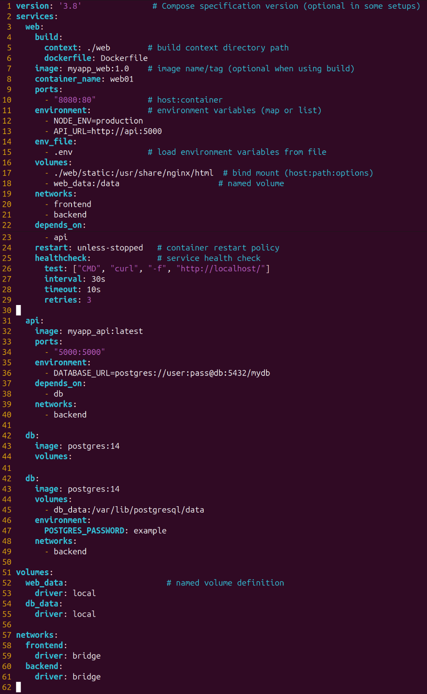

# Compose

Docker-Compose یک ابزار برای ساده‌سازی اجرای چند کانتینر مرتبط به هم است. در سناریوهای واقعی معمولاً یک اپلیکیشن تنها از یک سرویس تشکیل نمی‌شود؛ برای نمونه ممکن است نیاز باشد یک وب‌سرور (مانند Nginx)، یک پایگاه داده (مثل MySQL) و یک سرویس کش (مانند Redis) کنار هم کار کنند. مدیریت دستی این کانتینرها با دستورات docker run بسیار سخت و زمان‌بر خواهد بود. Docker Compose این مشکل را با یک فایل پیکربندی به نام docker-compose.yml حل می‌کند که در آن سرویس‌ها، شبکه‌ها و ولوم‌ها تعریف می‌شوند. سپس تنها با اجرای یک دستور می‌توان همه سرویس‌ها را هم‌زمان اجرا یا متوقف کرد.

از آنجایی که Docker-Compose وظیفه هماهنگ‌سازی (orchestration) این کانتینرها را بر عهده دارد، می‌توان آن را یک ابزار orchestration سبک دانست. تفاوت آن با ابزارهای پیچیده‌تر مثل Kubernetes این است که Compose بیشتر برای توسعه و محیط‌های کوچک یا تک‌ماشین طراحی شده است، در حالی که Kubernetes برای مقیاس بزرگ و کلاسترهای چندین سرور استفاده می‌شود.

## دستورات docker-compose

فرمت کلی فایل docker-compose بدین شکل است:

/// caption
///

### version

مشخص‌کنندهٔ نسخهٔ Compose استفاده شده برای این فایل(مثلاً '3.8').
این فیلد اغلب اختیاری است، اما نوشتن آن کمک می‌کند بفهمیم از چه قابلیت‌هایی در این فایل پشتیبانی می‌شود.
نسخه‌های مختلف، ویژگی های خاصی را فعال یا غیرفعال می‌کنند (مثلاً بعضی از گزینه‌ها در v2 و v3 تفاوت دارند).

### services

هستهٔ فایل؛ هر سرویس (کانتینر منطقی) به‌صورت یک کلید زیرِ services تعریف می‌شود (مثلاً web, db, cache).

برای هر سرویس می‌توانید مشخصات زیر را بنویسید:

* image
    *  نام ایمیج یا تگ (مثلاً nginx:latest یا myapp:1.0). 
* build
    *  برای ساخت ایمیج محلی؛ می‌تواند یک رشته (مثلاً ./app) یا یک map با context, dockerfile, args و غیره باشد.

* context
    * مسیر دایرکتوری که Dockerfile و منابع در آن است.
* dockerfile
    * نام فایل داکرفایل اگر غیر از 'Dockerfile' باشد.
* args
    * آرگومان های دستور build 
 

* container_name
    * یک نام دلخواه برای کانتینر

* ports
    *  تعیین پورت‌ها به فرم "HOST:CONTAINER"
    * مثال: "8080:80" یعنی درخواست‌های به پورت 8080 میزبان به پورت 80 کانتینر فرستاده شوند.
* expose
    *  پورت‌هایی که فقط به شبکهٔ داخلی سرویس‌ها اعلام می‌شوند.
* environment
    *  متغیرهای محیطی؛ می‌تواند به‌صورت لیست VAR=value باشد یا به‌صورت key:value باشد.
* volumes
* bind mount: ./host/path:/container/path — تغییرات ایجاد شده در میزبان همزمان در کانتینر دیده می‌شود.
    * named volume: myvolume:/container/path — داکر این بخش را مدیریت می‌کند، مناسب برای دیتابیس‌ها و داده های پایدار.

* networks
    *  اتصال سرویس به یکی یا چند شبکهٔ تعریف‌شده در بخش networks (مثلاً frontend, backend). شبکه‌ها امکان جداسازی و تعیین policy را می‌دهند.
 

* depends_on
    *  اعلام وابستگی شروع؛ داکر ترتیب راه‌اندازی را تضمین می‌کند (اول آنهایی که در depends_on آمده‌اند اجرا می‌شوند) اما به‌طور پیش‌فرض فقط شروع کانتینر را تضمین می‌کند، نه اینکه سرویس آماده به کار.

* command
    *  دستور/آرگومان‌هایی که هنگام اجرای کانتینر اجرا می‌شود (جایگزین CMD ایمیج می‌شود).

* restart
    *  سیاست ریستارت کانتینر؛ میتوان تعیین کرد که در چه مواقعی سیستم ریستارت شود.
* healthcheck
    *  بررسی سلامت سرویس؛ یعنی میتوان بعد اجرای سرویس بررسی کرد آیا سرویس به درستی کار میکند یا خیر. شامل test, interval, timeout, retries, start_period. این ویژگی برای orchestration و مانیتورینگ بسیار کارآمد است.
